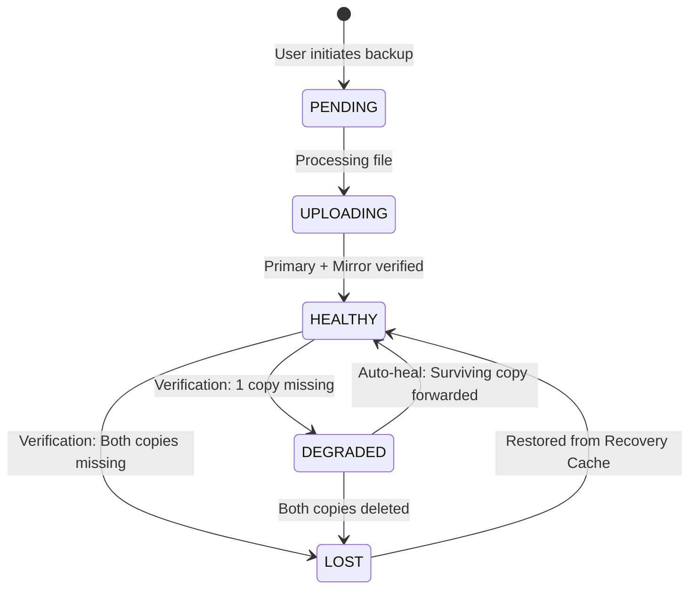

# TeleVault: Resilient, Append-Only Telegram Desktop & Web Backup Vault

> **A manual-only, append-only personal backup vault for Windows 11 leveraging Telegram MTProto cloud storage with dual-write redundancy, client-side AES-256-GCM encryption, automatic health self-healing, and disaster recovery.**

[](https://www.python.org/)
[](LICENSE)
[]()
[]()
[]()

---

## 1. System Overview & Core Invariants

TeleVault turns private Telegram channels into an append-only, zero-subscription cloud backup vault. Designed from first principles with **Clean Architecture**, it guarantees that your local files are protected without ever auto-syncing, silently overwriting, or deleting cloud archives.

### The 4 Non-Negotiable Invariants

1. **Invariant 1 — Single Document Upload:** Every backup file is uploaded as exactly one Telegram document (`force_document=True`). Files are never automatically chunked, zipped, or compressed. Original filenames, extensions, and exact byte counts are preserved.
2. **Invariant 2 — Zero Telegram Deletions:** The codebase contains zero calls to delete messages on Telegram. The cloud archive is strictly append-only. Local actions never delete cloud files. The test suite actively scans source ASTs to ensure `delete_messages` and `delete_dialog` cannot be introduced.
3. **Invariant 3 — Manual-Only Trigger (Rule 2b):** TeleVault contains no background file watchers, schedulers, or auto-sync daemons. Uploads happen only on direct user command. If a local file is modified on PC, the vault marks it as `"Changed since last backup"`; if deleted locally, it marks it as `"Only in Telegram"`.
4. **Invariant 4 — Restore Integrity:** A restored file is reported as successful only when a streaming SHA-256 byte-level verification matches the recorded index hash.

---

## 2. System Architecture

TeleVault is engineered with strict Clean Architecture separation of concerns:

```mermaid
graph TD
    subgraph Presentation Layer
        GUI[PyQt6 Desktop App]
        CLI[Rich Color CLI]
        WEB[FastAPI Web Dashboard]
    end

    subgraph Application Layer
        BackupUC[BackupFileUseCase]
        RestoreUC[RestoreFileUseCase]
        VerifyUC[VerifyVaultUseCase]
        HealUC[HealVaultUseCase]
        RebuildUC[RebuildIndexUseCase]
        SnapshotUC[SnapshotUseCase]
    end

    subgraph Domain Layer (Zero Dependencies)
        Ports[Protocols: TelegramGateway, VaultRepo, EventBus]
        Entities[FileRecord, MessageRef, VaultChannels]
        States[HealthState, LocalFileStatus, VaultMode]
    end

    subgraph Infrastructure Layer
        Telegram[TelethonGateway MTProto]
        Storage[SQLiteVaultRepository & RecoveryCache]
        Crypto[StreamCipher AES-256-GCM & Argon2id]
        OS[KeyringStore & SingleInstanceMutex]
        Fakes[FakeTelegramGateway in-memory]
    end

    GUI --> Application Layer
    CLI --> Application Layer
    WEB --> Application Layer
    Application Layer --> Domain Layer
    Infrastructure Layer -. implements .-> Ports
```

### Module Structure

```text
televault/
├── domain/                    # Pure business logic, entities, states, events, protocols
│   ├── entities.py            # FileRecord, MessageRef, VaultChannels, VaultMessage
│   ├── states.py              # HealthState, LocalFileStatus, VaultMode
│   ├── events.py              # DomainEvent classes (UploadProgress, StateChanged)
│   └── ports.py               # TelegramGateway, VaultRepository, EventBus protocols
├── application/               # Application use cases (pure business workflow orchestration)
│   ├── backup.py              # Single-document dual-write backup workflow
│   ├── restore.py             # Download with streaming SHA-256 verification
│   ├── verify.py              # Health audits against Primary and Mirror channels
│   ├── heal.py                # Server-side re-forwarding degraded items
│   ├── rebuild.py             # Disaster recovery index rebuild from tv1 captions
│   ├── snapshot.py            # SQLite index export and cloud backup
│   ├── dedupe.py              # Pre-upload hash-based duplicate detection
│   └── versioning.py          # Sequential same-path version management (v1, v2, v3)
├── infrastructure/            # Implementations of domain protocols
│   ├── telegram/              # Telethon MTProto gateway, retry, limits, and auth service
│   ├── storage/               # SQLite repo, migrations, and local recovery cache
│   ├── crypto/                # AES-256-GCM streaming encryption & Argon2id KDF
│   └── os/                    # Windows Credential Manager keyring, mutex, and SendTo
└── presentation/              # User interfaces
    ├── cli/                   # Rich colored terminal interface (__main__.py)
    ├── gui/                   # Native PyQt6 dark schematic desktop app
    └── web/                   # Modern FastAPI single-page web application
```

---

## 3. Resilience & State Machine

TeleVault manages data integrity through two decoupled state machines: Cloud Health State and Local PC Status.

### 3.1 Cloud Health State Machine



| Health State | Definition | Resolution |
| :--- | :--- | :--- |
| `HEALTHY` | Both `TeleVault Primary` and `TeleVault Mirror` copies verified present. | Full redundancy active. |
| `DEGRADED` | Exactly one copy (Primary OR Mirror) is missing or compromised. | **Auto-Heal:** Server-side forwards surviving copy back to missing channel. |
| `LOST` | Both cloud copies missing and local recovery copy unavailable. | Honest failure reported to user. |

### 3.2 Local PC Status (Decoupled per Rule 2b)

| Status | Meaning | Application Policy |
| :--- | :--- | :--- |
| `PRESENT` | Local file exists and SHA-256 matches latest backed-up version. | Display green indicator. Never auto-upload. |
| `CHANGED` | Local file exists at path, but modified timestamp or SHA-256 differs. | Show "Changed since last backup" + "Back up again" button. Never auto-upload. |
| `MISSING` | Local file no longer exists at local path. | Show "Only in Telegram" + "Restore" button. **Never delete cloud copies.** |

### 3.3 Healing Hierarchy

1. **One Cloud Copy Missing:** The surviving copy in Primary or Mirror is forwarded server-side via `forward_messages` in under 150 ms without client re-upload.
2. **Both Cloud Copies Missing:** TeleVault checks the local recovery cache (`%LOCALAPPDATA%/TeleVault/cache/<sha256>`). If present (< 500 MB threshold), it re-uploads to Primary and re-forwards to Mirror.
3. **Telegram Admin Log Window:** TeleVault scans the channel Admin Log (`iter_admin_log(delete=True)`). Telegram retains deletion events for ~48 hours, providing audit context on removed messages.
4. **Disaster Rebuild:** If the local SQLite database is deleted or wiped, `RebuildIndexUseCase` scans both Telegram channels, extracts `tv1` JSON metadata captions, and reconstructs the entire local database.

---

## 4. Telegram Gateway & Dual-Write Mirroring

### MTProto vs. Bot API

TeleVault exclusively uses **Telethon MTProto User Sessions**, completely rejecting the Telegram Bot API:
- **File Limit:** 2,000 MB (2 GB) for Free accounts; 4,000 MB (4 GB) for Telegram Premium accounts (Bot API is limited to 50 MB).
- **Channel Bootstrapping:** Automatically creates private `TeleVault Primary` and `TeleVault Mirror` channels.
- **Server-Side Forwarding:** `forward_messages` clones the document pointer server-side in milliseconds without consuming client bandwidth.

### Rate Limiting & FloodWait

TeleVault intercepts Telethon's `FloodWaitError(seconds)`:
1. Emits a domain event informing UI/CLI of throttling.
2. Asynchronously sleeps for `error.seconds + 1`.
3. Retries the operation safely without duplicating messages.
4. Upload concurrency defaults to `1` file at a time to protect personal Telegram accounts from anti-abuse flagging.

### Self-Describing Captions (`tv1` Protocol)

Every document uploaded carries a JSON caption enabling complete index reconstruction:
```json
tv1 {"id":"991f01b9-0d27-44b1-8d8f-12e57c930ed1","name":"report.pdf","sha256":"e3b0c44...","size":489201,"mtime":1774438800.0,"mode":"original","ver":1}
```

---

## 5. Security & Threat Model

### Assets & Protection Table

| Asset | Sensitivity | Storage Location | Protection Mechanism |
| :--- | :--- | :--- | :--- |
| **Telegram API Credentials** | Critical | Windows Credential Manager | Never committed, never printed in logs. |
| **MTProto Session (`.session`)** | Critical | `%LOCALAPPDATA%/TeleVault/` | OS user file ACL isolation. |
| **Original Mode Files** | High | Private Telegram Channels | Access restricted to account owner. |
| **Private Mode Files** | Critical | Private Telegram Channels | Client-side streaming AES-256-GCM + Argon2id. |
| **Encryption Passphrase** | Critical | Volatile memory only | Never persisted to disk. |
| **Local SQLite Database** | Medium | `%LOCALAPPDATA%/TeleVault/` | Automated snapshot backups to cloud channel. |

### Private Mode Encryption

- **Algorithm:** AES-256-GCM with authenticated tags.
- **Key Derivation:** Argon2id with 64 MB memory cost, 4 iterations, and random 16-byte salt.
- **Zero Cloud Knowledge:** Ciphertext filenames are converted to `<uuid>.enc`. Telegram servers and network eavesdroppers see only random ciphertext bytes and an opaque UUID with no metadata.

---

## 6. User Interfaces & Usage

TeleVault provides three native interfaces sharing the same application use cases:

### 6.1 Windows Batch Launcher (`televault.bat`)

Double-click `televault.bat` in Windows Explorer or run it from any command prompt for an interactive menu:

```cmd
===============================================================================
                          TELEVAULT CLI LAUNCHER                              
      Resilient, Append-Only Telegram Backup Vault (Windows 11 x64)           
===============================================================================

Available Quick Actions:
  [0] Launch Web Dashboard (Modern Browser App)
  [1] View Rich Color Dashboard & File List (dashboard / ls)
  [2] Log in to Telegram Account via MTProto (login)
  [3] Disconnect Telegram Account (logout)
  [4] Verify Vault Health across Telegram Channels (verify)
  [5] Verify and Auto-Heal Degraded Files (verify --heal)
  [6] Back up a File or Folder (backup)
  [7] Restore a File by ID (restore)
  [8] Rebuild Local Index from Telegram Channels (rebuild)
  [9] Create and Upload SQLite Snapshot (snapshot)
  [10] Show Full Command Line Help (--help)
  [11] Exit
```

### 6.2 Rich Color CLI

Full command line interface with colored status indicators, progress bars, and ASCII-safe tables:

```cmd
# Show status dashboard with summary metrics and protected files
televault dashboard
televault ls

# Authenticate personal Telegram account via MTProto
televault login

# Clear credentials and return to local simulation
televault logout

# Back up a file or directory
televault backup C:\Documents\TaxReturn.pdf
televault backup C:\Photos --private

# Verify health across Primary and Mirror channels
televault verify
televault verify --heal

# Restore file by Record ID
televault restore 560f48ba-797a-4f52-bc1b-239a3c2d3dae --dest C:\Restored

# Reconstruct index from Telegram channels after database loss
televault rebuild

# Create and upload encrypted SQLite snapshot
televault snapshot
```

### 6.3 Modern Web Application

Launch the browser-based dashboard powered by FastAPI and asynchronous MTProto:

```cmd
televault web
# Starts server on http://127.0.0.1:8000 and opens default browser
```

**Web UI Features:**
- **Cyberpunk / Glassmorphic UI:** Real-time health gauges, cloud dual-write indicators, and total storage metrics.
- **Visual Telegram Authentication:** Connect your Telegram account directly in the browser with phone, SMS/Telegram code, and 2FA password.
- **Drag-and-Drop Dropzone:** Drop files directly into the browser to trigger single-document dual-write uploads.
- **Local Path Direct Backup:** Back up multi-gigabyte local files without browser upload overhead.
- **One-Click Restore & Verification:** Restore files directly to disk with SHA-256 verification.
- **Live Event Audit Terminal:** View real-time logs of dual-write forwards, health audits, and auto-healing actions.

### 6.4 Native PyQt6 Desktop Application

Native Windows 11 desktop GUI featuring:
- Dark schematic aesthetic with responsive layout.
- Drag-and-drop landing target.
- Live pipeline strip showing real-time upload progress.
- First-run setup wizard, Settings, Health Diagnostic, and Over-Limit Dialogs.
- Windows single-instance mutex and "Send To" context menu integration.

---

## 7. Architecture Decisions Log (ADR)

| ID | Title | Summary of Decision |
| :--- | :--- | :--- |
| **001** | **MTProto User Session** | Rejected Telegram Bot API due to 50 MB limit. Standardized on Telethon MTProto user sessions for 2GB/4GB limits. |
| **002** | **Dual-Channel Mirroring** | Backup uploads to `TeleVault Primary` and server-forwards to `TeleVault Mirror` in milliseconds with zero extra bandwidth. |
| **003** | **Strict Append-Only** | Codebase contains zero calls to delete cloud messages. AST constitution scanner verifies no delete calls can exist. |
| **004** | **Clean Architecture Ports** | Defined `TelegramGateway`, `VaultRepository`, and `EventBus` as `@runtime_checkable` Python Protocols. |
| **005** | **Sequential Concurrency** | Upload concurrency ceiling set to `1` by default to protect personal Telegram accounts from FloodWait bans. |
| **006** | **`tv1` JSON Captions** | Every cloud document carries a JSON caption enabling total index reconstruction if local SQLite is lost. |
| **007** | **Streaming 1 MB Hashing** | SHA-256 hashing processes files in 1 MB chunks to maintain low memory usage (< 50 MB) on large files. |
| **008** | **ASCII Bracketed Indicators** | Used ASCII tags (`[HEALTHY]`, `[DEGRADED]`, `[DONE]`) to guarantee compatibility across Windows terminal code pages (CP1252/UTF-8). |
| **009** | **Fake Gateway Default** | Tests and unconfigured CLI calls default to `FakeTelegramGateway` to ensure live Telegram accounts are never touched without user consent. |
| **010** | **Auto-Closing SQLite Context** | Wrapped SQLite operations in an auto-closing context manager to prevent Windows file locking issues (`WinError 32`). |
| **011** | **Local Recovery Cache** | Retained temporary local recovery copies for files under 500 MB in `%LOCALAPPDATA%/TeleVault/cache/<sha256>` until dual-write verification. |
| **012** | **Channel Discovery Rebuild** | Implemented `RebuildIndexUseCase` to iterate Primary and Mirror channels and restore all metadata entries after database wipe. |

---

## 8. Risk Register & Mitigations

| Risk | Likelihood | Impact | Mitigation in TeleVault |
| :--- | :--- | :--- | :--- |
| **Account Ban from API Abuse** | Low | Critical | Concurrency = 1 default, polite backoff on `FloodWaitError`, no background sync or polling. |
| **Data Loss from Cloud Deletion** | Low | High | Dual-write to Primary + Mirror channels, local recovery cache, and 48-hour Telegram Admin Log scanning. |
| **Silent Bitrot / Corruption** | Medium | High | Streaming SHA-256 computed on disk and recorded in `tv1` caption; mandatory SHA-256 verification on restore. |
| **Local Database Destruction** | Medium | Medium | Automated SQLite snapshots uploaded to Primary channel + channel rebuild from `tv1` captions. |
| **Exposure of Sensitive Data** | Medium | Critical | Private Mode client-side AES-256-GCM encryption with Argon2id; zero metadata stored in Telegram. |

---

## 9. Testing & Quality Assurance

TeleVault features a comprehensive test suite of **42 passing tests** validated across all phases:

```cmd
# Run complete test suite
python -m pytest tests/ -v
```

### Test Suite Breakdown

1. **Acceptance Suite (`tests/acceptance/test_acceptance_suite.py`):**
   - Single-document dual-write simulation.
   - Primary deletion detection and auto-healing.
   - Double deletion recovery via local cache and marking LOST.
   - Disaster recovery index rebuild from Telegram captions.
   - Restore SHA-256 byte verification and timestamp preservation.
   - Over-limit check (2 GB / 4 GB threshold).
   - Private Mode AES-256-GCM roundtrip and corrupt passphrase rejection.
   - Decoupled manual-only local PC deletion and modification checks.
2. **Constitution Invariant Tests (`tests/test_invariants.py`):**
   - AST code scanner enforcing zero `delete_messages` or `delete_dialog` calls.
   - AST scanner verifying zero background schedulers (`watchdog`, `apscheduler`).
   - Fake gateway zero-delete call auditing.
   - Single-document `force_document=True` enforcement.
3. **Unit Tests (`tests/unit/`):**
   - Streaming hash calculation, deduplication, and sequential versioning.
   - SQLite repository CRUD and migrations.
   - Cryptographic Argon2id KDF and AES-GCM stream cipher roundtrip.
   - PyQt6 desktop GUI widget smoke tests and single-instance mutex.
   - CLI command parsing and dashboard rendering.

---

## 10. Packaging & Installation

### Developer Setup

```powershell
# Clone the repository
git clone https://github.com/ankitshx/TELEVAULT.git
cd TELEVAULT

# Install dependencies
pip install PyQt6 telethon keyring cryptography argon2-cffi fastapi uvicorn rich pytest

# Run tests
python -m pytest tests/ -v

# Launch interactive CLI
.\televault.bat

# Launch Web Dashboard
python -m televault.presentation.cli web
```

### Standalone Executable & Installer

- **PyInstaller Specification:** [`packaging/televault.spec`](file:///x:/TELEVAULT/packaging/televault.spec) packages TeleVault into a standalone single-file Windows executable:
  ```cmd
  pyinstaller packaging/televault.spec
  ```
- **Inno Setup Installer:** [`packaging/installer.iss`](file:///x:/TELEVAULT/packaging/installer.iss) compiles `TeleVault_Setup_v0.1.0.exe` with desktop shortcut, Start Menu entry, and Windows Explorer "Send To" integration.
