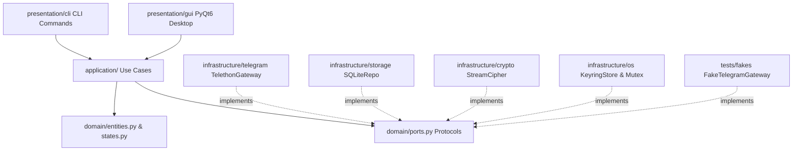

# TeleVault Architecture: Clean Architecture & Port Isolation

**Author:** Agent Manager (Lead Orchestrator)  
**Status:** Approved for Phase 0  

---

## 1. Architectural Layers

TeleVault follows strict **Clean Architecture** boundaries:



### 1.1 Inversion of Control & Port Contracts
- The domain and application layers have **zero imports** of external libraries (`Telethon`, `PyQt6`, `sqlite3`, `keyring`).
- All external services are accessed strictly through `typing.Protocol` interfaces defined in `televault.domain.ports`.
- In-memory testing uses `tests.fakes.fake_gateway.FakeTelegramGateway`, enabling full CI validation in seconds without network dependencies or live Telegram accounts.

---

## 2. Directory Layout & Module Responsibilities

```text
televault/
├── domain/                    # Pure business rules & entities (Zero external dependencies)
│   ├── entities.py            # FileRecord, MessageRef, VaultChannels, VaultMessage
│   ├── states.py              # HealthState, LocalFileStatus, ExistsStatus
│   ├── events.py              # DomainEvent classes (UploadProgress, StateChanged, etc.)
│   └── ports.py               # TelegramGateway, VaultRepository, EventBus Protocols
├── application/               # Application use cases (orchestrate domain & ports)
│   ├── backup.py              # Dual-write backup use case (upload + mirror + verify)
│   ├── restore.py             # Download + SHA-256 verification + metadata restore
│   ├── verify.py              # Health check against Primary and Mirror
│   ├── heal.py                # Server-side re-forwarding degraded items
│   ├── rebuild.py             # Index reconstruction from tv1 captions
│   ├── dedupe.py              # Pre-upload hash check
│   ├── versioning.py          # File version management
│   └── queue.py               # Sequential job queue runner (concurrency = 1)
├── infrastructure/            # Outward-facing implementations
│   ├── telegram/              # Telethon MTProto client, limits, retry, FloodWait
│   ├── storage/               # SQLite repo, migrations, snapshot exporter
│   ├── crypto/                # AES-256-GCM streaming encryption & argon2id KDF
│   └── os/                    # Windows keyring, Send-To shortcut, single-instance mutex
├── presentation/              # User interfaces (Call use cases, listen to EventBus)
│   ├── gui/                   # PyQt6 dark schematic UI, widgets, dialogs, tray
│   └── cli/                   # televault CLI commands (backup, restore, verify, ls)
assets/                        # Bundled fonts (JetBrains Mono, IBM Plex Mono) and icons
tests/                         # Invariant tests, unit tests, fakes, integration tests
packaging/                     # PyInstaller spec, Inno Setup script
docs/                          # System specifications, threat model, architecture
```

---

## 3. The 4 Constitution Invariants

TeleVault enforces 4 non-negotiable invariants run at every phase gate:
1. **Single Document Upload:** Every upload is exactly one Telegram document (`force_document=True`, no chunking).
2. **Zero Telegram Deletions:** No code path deletes Telegram messages. The cloud vault is strictly append-only.
3. **Manual-Only Trigger:** No code path uploads without a direct user action (no background auto-sync, no watched folders).
4. **Restore Integrity:** A restore is reported successful only when the downloaded file's SHA-256 matches the original hash.
