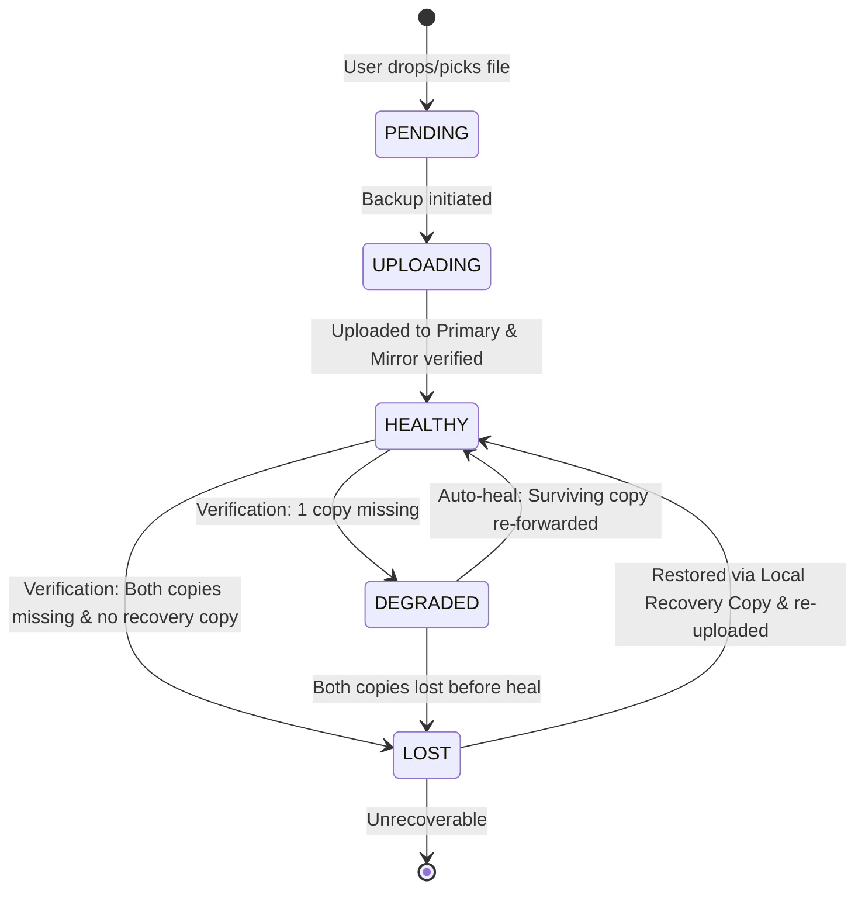

# Vault State Machine & Resilience Specification

**Owner:** Agent 2 (Vault and Resilience)  
**Status:** Approved for Phase 0  

---

## 1. Health States

| State | Description | Invariant Guarantee |
| :--- | :--- | :--- |
| `PENDING` | File queued by explicit user action; not yet processed. | No network traffic initiated. |
| `UPLOADING` | Active streaming upload to Primary and server forward to Mirror. | Concurrency = 1. Progress reported. |
| `HEALTHY` | Both Primary and Mirror copies verified present with matching document size and SHA-256. | File is safe and redundant. |
| `DEGRADED` | Exactly one copy (Primary OR Mirror) is missing or tampered. | Auto-heal can repair by forwarding surviving copy. |
| `LOST` | Both cloud copies missing and local recovery copy unavailable. | Honest failure. Clearly reported to user. |

---

## 2. Local File Status (PC vs. Vault)

The local file on the user's PC is decoupled from the cloud vault records per Rule 2b:

| Local Status | Meaning | Permitted App Action | Forbidden App Action |
| :--- | :--- | :--- | :--- |
| `PRESENT` | Local file exists and SHA-256 matches latest backed-up version. | Show green indicator. | Never re-upload automatically. |
| `CHANGED` | Local file exists at original path, but modified timestamp or SHA-256 differs. | Show "Changed since last backup" + "Back up again" button. | Never auto-upload new version without user click. |
| `MISSING` | Local file no longer exists at original path. | Show "Only in Telegram" + "Restore" button. | Never delete cloud copies. Never auto-download. |

---

## 3. Healing & Recovery Hierarchy

When health check detects a compromised record:
1. **Case: One Cloud Copy Missing (Primary OR Mirror)**
   - Status: `DEGRADED`.
   - Resolution: Forward surviving copy back into the missing channel via server-side forward. Update `MessageRef`. Re-verify -> `HEALTHY`.
2. **Case: Both Cloud Copies Missing**
   - Check local recovery cache (`%LOCALAPPDATA%/TeleVault/cache/<sha256>`). If present, verify local hash, re-upload to Primary, re-forward to Mirror -> `HEALTHY`.
   - If no recovery cache, scan channel Admin Log (`iter_admin_log(delete=True)`). If found within Telegram's ~48h window, notify with context.
   - If unrecoverable, mark state `LOST`.
